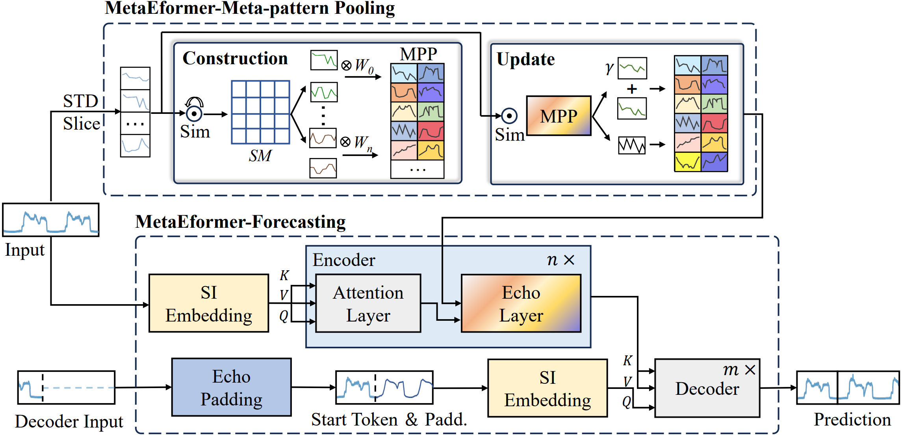

# Beyond Patterns: Purifying Meta-patterns from Time Series for Complex and Dynamic Systems Load Forecasting

This repo is the official Pytorch implementation of MetaEformer. 


## MetaEformer Framework

Framework overview of MetaEformer, consisting of two main parts: Meta-pattern Pooling and Forecasting.

## Augmented Dickey-Fuller (ADF) test
- In `math/ `, we provide code for conducting ADF tests on various datasets.


## Getting Started
### Environment Requirements

Install Python 3.8. For convenience, execute the following command.

```
pip install -r requirements.txt
```

### Data Preparation

You can obtain all the datasets in the `./dataset` directory. All the datasets are well pre-processed and can be used easily.


### Training Example
- In `scripts/ `, we provide training scripts for different scenarios *Cloud/Power/Traffic*

For example:

To train the **MetaEformer** on **Cloud dataset**, you can use the scipt `scripts/Cloud.sh`:
```
sh scripts/Cloud.sh
```
It will start to train MetaEformer by default parameters.


