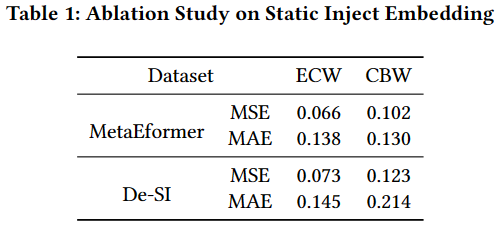

# Ablation Study on Static Inject Embedding

We appreciate the suggestions provided by Reviewer nvzE. In this document, we conduct an ablation study on Static Inject (SI) Embedding to verify the effectiveness of the designed SI Embedding.

## Experiment

### Result analysis
We adopted the reviewer's suggestion to directly stack the static information, referred to as De-SI. As seen in Table 1, direct stacking does not perform as well as our SI Embedding approach. This likely stems from the fact that SI Embedding further integrates the temporal and static information through two linear layers, empowering the model to autonomously select and fuse embedding features. This integration facilitates learning the associations between static information and load patterns in a high-dimensional space, thereby enhancing the model's robustness in similar external environments and improving its ability to handle challenges associated with entity switching and new entities.