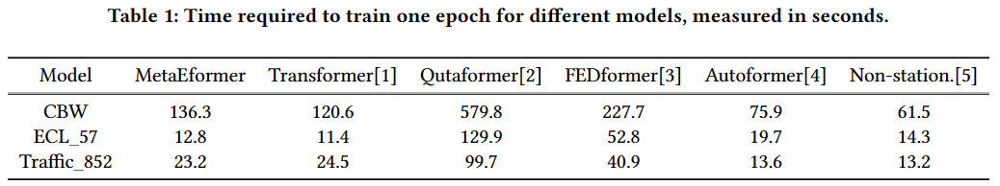

# Computational Efficiency and Complexity Analysis

To address the common concerns of reviewers unVk, 3Xga, PJ9Z's regarding computational efficiency and complexity, we conduct the following complexity analysis with traning time comparison experiment.

## Complexity Analysis

**Transformer Complexity:** 

For an input length $L$, batch size $B$, and hidden layer dimension $d$, the computational complexity of a transformer mainly comes from:

* **Self-Attention:**  $(O(L^2d))$
* **Feed-Forward layers:**  $(O(Ld^2))$

If the Transformer has $N$ layers, the total computational complexity is:

$$
O(B \cdot N \cdot (L^2 \cdot d + L \cdot d^2))
$$

**MetaEformer's New Modules:** 

Assuming a slice length $s$, each sequence can be divided into $L/s = n$ slices \(usually small and can be neglected\), and the size of the MPP is $P$.

* **MPP Construction:**
  * Decomposition: $O(BL)$ and slicing $O(B * L/s * s) \approx O(B L)$
  * Sim Calculation: $O((BL/s)^2s)=O((Bn)^2s)≈O(B^2s)$
  * Constructing: finding max similarity, checking the threshold, weighted generation of MPP: $O(BN)$
  * The MPP Construction is dominated by the similarity calculation: $O(B^2s)$
* **MPP Updating:**

  * Similarity calculation changes to $O(B * L/s * P * s) = O(B L P)$
  * The MPP Updating is also dominated by the similarity calculation: $O(BLP)$
* **Echo Layer:**

  * Top-K Sim Calculation: $(O(n \cdot B \cdot L/s \cdot P \cdot s) \approx O(B \cdot L \cdot P)$
  * Softmax and Concatenation: The softmax and concatenation operations have complexities of $O(B \cdot s \cdot K)$

**Total New Complexity Introduced:**
$O(B^2 \cdot s) + O(B \cdot L \cdot P) + O(B \cdot L \cdot P) + O(B \cdot s \cdot K) \approx O(B(Bs + LP + sK))$

Note that MetaEformer does not perform MPP Construction and Updating at every training iteration. Specifically, MPP Construction only occurs during the first training batch, while Updating frequency is generally set to $\frac{1}{M}$ of training epochs. This reduces the added complexity to:

$$O(B(\frac{Bs}{E}+\frac{LP}{M}+sK))$$

where E is the total number of iterations required for training (epoch*batches per epoch), M is the frequency of performing MPP updates.

**Conclusion:**

Ultimately, the complexity of the native components of Transformer-like models exceeds the new components introduced by MetaEformer by an order of:

$$\frac{N(Ld+d^2)}{K}$$

With common deep learning task settings, this scale can be hundreds of times larger. 

Therefore, we assert that the additional computational complexity from MetaEformer is **negligible** in contrast to the native complexity of Transformer-like models. 
The experimental results below also demonstrate a significant increase in the model's accuracy and robustness for complex dynamic system load forecasting with minimal extra computational cost.

Moreover, as demonstrated in the Autoformer study [4], the full attention mechanism of the Transformer do not fall behind in computational efficiency compared to other attention-variant models for predictions of lengths not considered extreme. This finding is also supported by our experimental results.

  

## Experiments

### Result analysis
In Table 1, we present the training times required for a single epoch by our proposed MetaEformer compared to other Transformer-based models. The values represent the average time taken across multiple epochs, measured in seconds. Consistent with our prior analysis, the MetaEformer demonstrates only a marginal slowdown compared to the classic Transformer architecture. The training time of our model is on the same order of magnitude as other advanced Transformer-like models, making it entirely acceptable for practical applications. Notably, it achieves quicker per-epoch training times than both Qutaformer and FEDformer on all datasets examined.

### References
[1] Vaswani A, Shazeer N, Parmar N, et al. Attention is all you need[J]. Advances in neural information processing systems, 2017, 30.

[2] Chen W, Wang W, Peng B, et al. Learning to rotate: Quaternion transformer for complicated periodical time series forecasting[C]//Proceedings of the 28th ACM SIGKDD conference on knowledge discovery and data mining. 2022: 146-156.

[3] Zhou T, Ma Z, Wen Q, et al. Fedformer: Frequency enhanced decomposed transformer for long-term series forecasting[C]//International conference on machine learning. PMLR, 2022: 27268-27286.

[4] Wu H, Xu J, Wang J, et al. Autoformer: Decomposition transformers with auto-correlation for long-term series forecasting[J]. Advances in neural information processing systems, 2021, 34: 22419-22430.

[5] Liu Y, Wu H, Wang J, et al. Non-stationary transformers: Exploring the stationarity in time series forecasting[J]. Advances in Neural Information Processing Systems, 2022, 35: 9881-9893.

