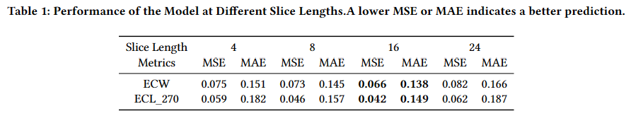
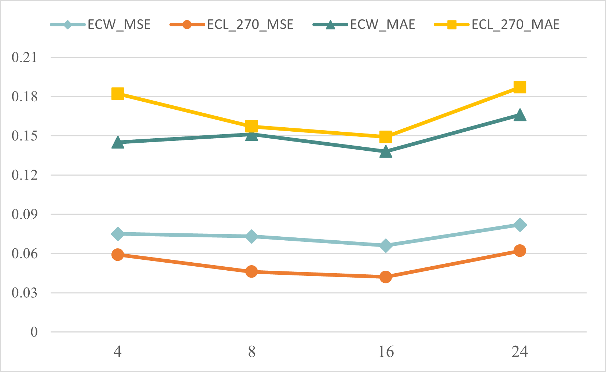

# Sensitivity Analysis of Slice Length

We thank Reviewer zr17 for their suggestions. In this document, we discuss the parameter sensitivity of Slice size.

## Experiment

### Result analysis
From the tables and figures, it is evident that our model is not highly sensitive to Slice size, with performance remaining within a certain range across different sizes. This indicates that the meta-pattern pool (MPP) and Echo Layer mechanism implemented in our study effectively function across various sizes. However, it is important to note that overly short lengths may disrupt the pattern information in the data, while excessively long lengths may increase the risk of multiple patterns coexisting. Therefore, in our model, we have chosen a slice length of 16, which is one-third of the input length, as optimal.
